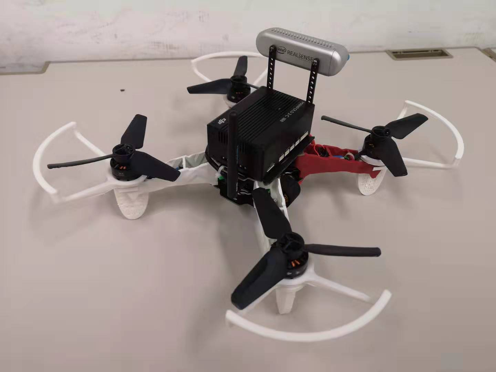

Welcome to the MaRS Quadrotor Manual book!

## UAV Platform

The UAV platform for SAVE project is shown below:

    
    

The UAV platform is built based on Q250 Quadrotor and is mainly consist of four parts:

1. A standard quadrotor UAV with [Pixhawk 4 mini](https://docs.px4.io/v1.9.0/en/flight_controller/pixhawk4_mini.html) flight controller and relative devices (NO GPS).

2. A [DJI manifold 2](https://www.dji.com/cn/manifold-2) onboard computer with Intel i7 processor.

3. A [realsense D435i](https://www.intelrealsense.com/zh-hans/depth-camera-d435i/) camera.

4. Communication devices: A Two way [data telementry](https://docs.px4.io/v1.9.0/en/telemetry/holybro_sik_radio.html) and a 2.4 GHz [RC transmitter-receiver](https://www.rc.futaba.co.jp/english/propo/air/14sg.html).
